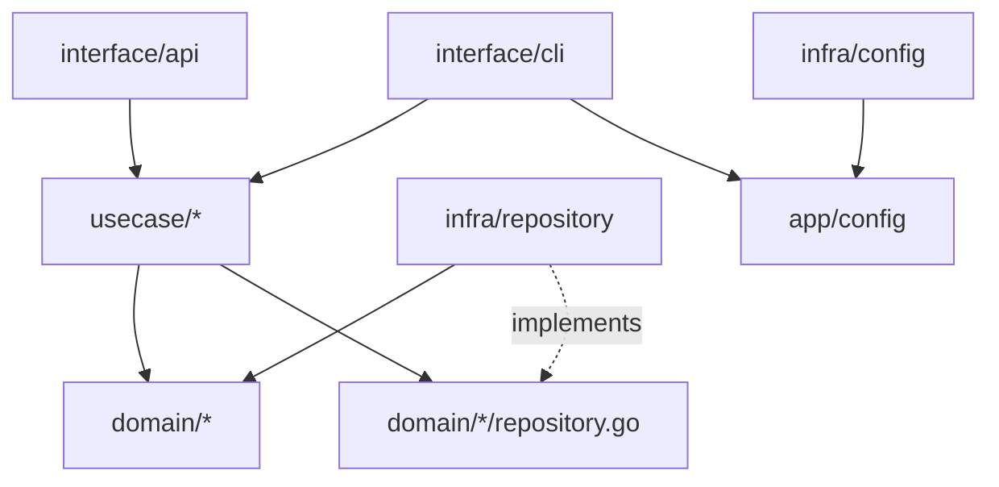

# ディレクトリ構造テンプレート

**このドキュメントは新機能追加時のディレクトリ構造の参考テンプレートです**

## 理想的なプロジェクト構造

```
internal/
├── domain/                    # ビジネスロジックの核心
│   ├── task/                  # タスク管理ドメイン
│   │   ├── entity.go          # Task エンティティ
│   │   ├── value_object.go    # TaskID, Priority など
│   │   ├── repository.go      # TaskRepository インターフェース
│   │   ├── service.go         # TaskSelectionService
│   │   └── error.go           # TaskNotFoundError など
│   │
│   ├── state/                 # 状態管理ドメイン
│   │   ├── entity.go          # State エンティティ
│   │   ├── repository.go      # StateRepository インターフェース
│   │   └── service.go         # StateTransitionService
│   │
│   ├── journal/               # ジャーナルドメイン
│   │   ├── entity.go          # JournalEntry エンティティ
│   │   ├── repository.go      # JournalRepository インターフェース
│   │   └── service.go         # JournalService
│   │
│   └── health/                # ヘルスチェックドメイン
│       ├── entity.go          # HealthReport エンティティ
│       ├── service.go         # HealthCheckService
│       └── validator.go       # 各種バリデーター
│
├── usecase/                   # アプリケーション固有のビジネスルール
│   ├── task/
│   │   ├── pick_next_task_usecase.go
│   │   ├── register_task_usecase.go
│   │   ├── complete_task_usecase.go
│   │   ├── input.go           # 入力DTO
│   │   └── output.go          # 出力DTO
│   │
│   ├── diagnostics/
│   │   ├── run_diagnostics_usecase.go
│   │   ├── validate_state_usecase.go
│   │   └── repair_data_usecase.go
│   │
│   └── statistics/
│       ├── show_statistics_usecase.go
│       └── generate_report_usecase.go
│
├── interface/                 # 外部とのインターフェース
│   ├── cli/                   # CLIインターフェース（薄いラッパー）
│   │   ├── root.go            # ルートコマンド
│   │   ├── pick_cmd.go        # pickコマンド（薄い）
│   │   ├── register_cmd.go    # registerコマンド（薄い）
│   │   ├── run_cmd.go         # runコマンド（薄い）
│   │   ├── doctor_cmd.go      # doctorコマンド（薄い）
│   │   └── stats_cmd.go       # statsコマンド（薄い）
│   │
│   ├── api/                   # 将来のREST API
│   │   └── handler/
│   │
│   └── grpc/                  # 将来のgRPC
│       └── server/
│
├── infra/                     # インフラストラクチャ層
│   ├── repository/            # リポジトリ実装
│   │   ├── task/
│   │   │   ├── file_task_repository.go
│   │   │   └── memory_task_repository.go  # テスト用
│   │   │
│   │   ├── state/
│   │   │   └── file_state_repository.go
│   │   │
│   │   └── journal/
│   │       └── file_journal_repository.go
│   │
│   ├── external/              # 外部サービス
│   │   ├── claude/
│   │   │   └── claude_client.go
│   │   └── github/
│   │       └── github_client.go
│   │
│   ├── persistence/           # 永続化の詳細
│   │   ├── file/
│   │   │   ├── atomic_writer.go
│   │   │   └── transaction_manager.go
│   │   └── cache/
│   │       └── memory_cache.go
│   │
│   └── config/                # 設定管理
│       ├── loader.go          # 設定ローダー
│       └── validator.go       # 設定バリデーター
│
└── app/                       # アプリケーション設定・初期化
    ├── container/             # DI コンテナ
    │   └── container.go
    ├── config/                # アプリケーション設定
    │   └── config.go
    └── bootstrap/             # 起動処理
        └── bootstrap.go
```

## 新機能追加時のファイル作成例

### 例：「タスク優先度自動調整機能」を追加する場合

```bash
# 1. Domain層
internal/domain/task/
├── priority_adjuster.go      # NEW: 優先度調整ドメインサービス
└── priority_rules.go         # NEW: 優先度ルール

# 2. UseCase層
internal/usecase/task/
├── adjust_priority_usecase.go  # NEW: 優先度調整ユースケース
├── input.go                     # UPDATE: AdjustPriorityInput追加
└── output.go                    # UPDATE: AdjustPriorityOutput追加

# 3. Infrastructure層
internal/infra/repository/task/
└── file_task_repository.go     # UPDATE: UpdatePriority()メソッド追加

# 4. Interface層
internal/interface/cli/
└── adjust_priority_cmd.go      # NEW: adjust-priorityコマンド
```

## パッケージ間の依存関係



## ファイル命名規則

### Domain層
- エンティティ: `{entity_name}.go` (例: `task.go`)
- 値オブジェクト: `{vo_name}_vo.go` (例: `task_id_vo.go`)
- リポジトリIF: `{entity}_repository.go` (例: `task_repository.go`)
- ドメインサービス: `{service_name}_service.go` (例: `task_selection_service.go`)

### UseCase層
- ユースケース: `{action}_{entity}_usecase.go` (例: `pick_next_task_usecase.go`)
- 入力DTO: `input.go` または `{usecase}_input.go`
- 出力DTO: `output.go` または `{usecase}_output.go`

### Infrastructure層
- リポジトリ実装: `{storage}_{entity}_repository.go` (例: `file_task_repository.go`)
- 外部クライアント: `{service}_client.go` (例: `claude_client.go`)

### Interface層
- CLIコマンド: `{command}_cmd.go` (例: `pick_cmd.go`)
- APIハンドラー: `{resource}_handler.go` (例: `task_handler.go`)

## テストファイルの配置

各層のテストは同じディレクトリに配置：

```
internal/domain/task/
├── entity.go
├── entity_test.go          # ユニットテスト
├── service.go
└── service_test.go         # ユニットテスト

internal/usecase/task/
├── pick_next_task_usecase.go
└── pick_next_task_usecase_test.go  # ユースケーステスト

internal/infra/repository/task/
├── file_task_repository.go
└── file_task_repository_test.go    # 統合テスト
```

## 注意事項

1. **新機能は必ずこの構造で実装する**
2. **既存コードを修正する際は、可能な限りこの構造に近づける**
3. **interface/cli層にビジネスロジックを書かない**
4. **domain層は他の層に依存しない**
5. **循環参照を避ける**

## 移行時の一時的な構造

既存コードからの移行期間中は、以下の構造も許容：

```
internal/
├── legacy/              # 既存コードの一時的な配置場所
│   └── cli/            # 移行前のCLIコード
│
└── [新しい構造]        # 上記の理想的な構造
```

段階的に`legacy/`から新構造へ移行する。