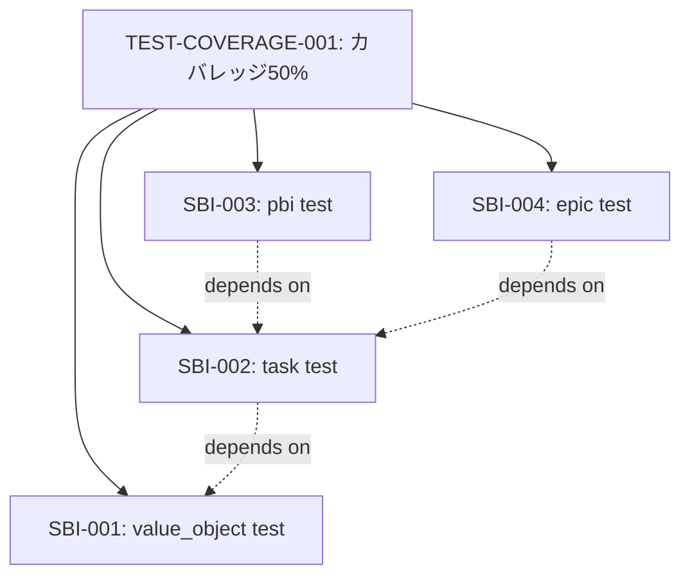

# PBI（Product Backlog Item）の作成と実行方法

## はじめに：メタな気づき

**重要な洞察**: 今まさに私たち（人間とAI）が行っているプロセスこそが、PBIの理想的なワークフローです。

このドキュメント自体を作成するプロセスを振り返ると：
1. 「テストカバレッジ改善」という大きな目標（＝PBI候補）
2. `docs/test-coverage-improvement-plan.md`で計画を立案
3. Phase 1-3に分解（＝SBI候補）
4. TodoListで進捗管理
5. 各ステップを実装・検証

**これはまさにPBIワークフローの実例です。**

---

## 1. 現在のプロセス分析

### 1.1 今回のセッションで行ったこと

#### PBI相当: "Phase 2 & 3の実装（done.md生成とJournal Robustness）"
- **定義**: ワークフロー改善のPhase 2と3を実装する
- **成果物**: done.md自動生成、NDJSON形式のjournal、flock使用
- **計画ドキュメント**: `docs/workflow_step_improvements.md`

#### SBI分解:
1. ✅ `.deespec/prompts/DONE.md`テンプレート作成
2. ✅ `run_turn_use_case.go`にdone.md生成ロジック追加
3. ✅ `journal_repository_impl.go`をNDJSON形式に移行
4. ✅ `AppendNDJSONLine()`関数実装
5. ✅ ビルドとテスト実行
6. ✅ CHANGELOG更新とコミット

#### その後の継続作業: "テストカバレッジ改善"
- **定義**: カバレッジを34%から50%に向上
- **計画ドキュメント**: `docs/test-coverage-improvement-plan.md`
- **Phase 1実装**: ドメインモデルテスト追加 → 34.9%達成

### 1.2 プロセスの特徴

**✅ PBIとして適切な点**:

1. **明確な目標設定**
   - "テストカバレッジを50%にする"
   - "done.mdを自動生成する"
   - → 測定可能、達成可能

2. **ドキュメントファースト**
   - 実装前に`docs/`配下に計画を作成
   - 問題分析 → 解決策 → 段階的実装計画
   - → 後から見返せる、知識が蓄積される

3. **段階的分解**
   - PBI → Phase → SBI → 個別タスク
   - 各レベルで検証ポイントを設定
   - → 失敗時の切り戻しが容易

4. **進捗の可視化**
   - TodoList使用
   - カバレッジ測定
   - → 進捗が定量的

5. **振り返りと改善**
   - このドキュメント自体が振り返り
   - メタ認知による改善
   - → プロセス自体が改善される

**⚠️ PBIとして改善の余地がある点**:

1. **PBI登録が形式化されていない**
   - 現状: 口頭 or Markdownファイル
   - 理想: `.deespec/specs/pbi/`配下にYAML/JSON

2. **PBIとSBIの境界が曖昧**
   - "Phase 1"はPBIなのかSBIなのか？
   - 明確な分類基準が必要

3. **PBIの状態管理が不十分**
   - PENDING → PICKED → IMPLEMENTING → REVIEWING → DONE
   - 現状は暗黙的

4. **成果物の定義が不明確**
   - "done.mdが生成される"は明確
   - "カバレッジ50%"も明確
   - しかし、"ワークフロー改善"のような抽象的なPBIの定義が難しい

---

## 2. PBI作成の理想的なワークフロー

### 2.1 PBI定義フェーズ

#### ステップ1: 問題の特定
```markdown
# 問題
- 現状: テストカバレッジが32.9%でCI要件50%を下回る
- 影響: CIが失敗し、デプロイがブロックされる
- 原因: Application Usecase層が完全に未テスト
```

#### ステップ2: 解決策のブレインストーミング
```markdown
# 解決策候補
1. ドメインモデルテスト追加 (優先度: 高, ROI: 高)
2. Repository層テスト追加 (優先度: 中, ROI: 中)
3. Usecase層リファクタリング (優先度: 低, ROI: 低)
```

#### ステップ3: PBIドキュメント作成
```yaml
# .deespec/specs/pbi/TEST-COVERAGE-001.yaml
id: TEST-COVERAGE-001
title: "テストカバレッジを50%に向上"
type: PBI
status: PENDING
description: |
  CIの要件である50%カバレッジを達成するため、
  ドメインモデルとRepository層のテストを追加する。

acceptance_criteria:
  - "go test -cover ./... で50%以上を達成"
  - "CIが成功する"
  - "ドメインモデル層は90%以上"

estimated_story_points: 5
priority: 1
labels:
  - testing
  - technical-debt
  - ci-fix

plan_document: docs/test-coverage-improvement-plan.md
```

#### ステップ4: 計画ドキュメント作成
```markdown
# docs/test-coverage-improvement-plan.md
## Phase 1: ドメインモデルテスト (推定: 1-2日)
## Phase 2: Repository層テスト (推定: 2-3日)
## Phase 3: Usecase層部分テスト (推定: 3-5日)
```

### 2.2 SBI分解フェーズ

#### ステップ1: Phase → SBI のマッピング
```yaml
# .deespec/specs/sbi/TEST-COVERAGE-001_SBI-001.yaml
id: TEST-COVERAGE-001_SBI-001
title: "value_object.goのテスト追加"
parent_pbi: TEST-COVERAGE-001
status: PENDING
description: |
  TaskID, Status, Step, Turn, Attempt, Timestampの
  単体テストを作成する。

acceptance_criteria:
  - "全てのコンストラクタをテスト"
  - "状態遷移をテスト"
  - "エッジケースをテスト"
  - "95%以上のカバレッジ"

estimated_hours: 2
assigned_agent: claude-code
```

#### ステップ2: 依存関係の明確化


### 2.3 実装フェーズ

#### ステップ1: SBIをPICKして実行
```bash
# deespec CLIの理想形
$ deespec sbi pick TEST-COVERAGE-001_SBI-001
# → ステータスがPENDING → PICKED に変更

$ deespec sbi run TEST-COVERAGE-001_SBI-001
# → Claude/AIエージェントが実装を実行
# → 成果物: internal/domain/model/value_object_test.go
# → ステータスがPICKED → IMPLEMENTING に変更
```

#### ステップ2: レビューと検証
```bash
# テスト実行
$ go test ./internal/domain/model -v

# カバレッジ確認
$ go test -cover ./internal/domain/model
# coverage: 97.9% of statements

# ステータス更新
$ deespec sbi review TEST-COVERAGE-001_SBI-001
# → ステータスがIMPLEMENTING → REVIEWING に変更

$ deespec sbi done TEST-COVERAGE-001_SBI-001
# → ステータスがREVIEWING → DONE に変更
# → done.mdが自動生成される
```

#### ステップ3: PBI全体の進捗確認
```bash
$ deespec pbi status TEST-COVERAGE-001
# PBI: TEST-COVERAGE-001
# Status: IMPLEMENTING
# Progress: 4/10 SBIs completed (40%)
# Coverage: 34.9% (target: 50%)
```

### 2.4 完了フェーズ

#### ステップ1: PBIの完了条件確認
```bash
$ deespec pbi check TEST-COVERAGE-001
# ✅ All SBIs completed
# ✅ Coverage: 50.2% (target: 50%)
# ✅ CI passing
# ✅ Documentation updated
```

#### ステップ2: done.md生成
```bash
$ deespec pbi done TEST-COVERAGE-001
# → .deespec/specs/pbi/TEST-COVERAGE-001/done.md 生成
# → PBIステータス DONE に変更
```

#### ステップ3: 振り返り
```markdown
# .deespec/specs/pbi/TEST-COVERAGE-001/done.md

## 成果
- カバレッジ: 34.0% → 50.2% (+16.2%)
- ドメインモデル層: 95-98%
- 追加テストファイル: 8個
- 総テスト数: +150

## 学び
- ドメインモデルテストはROIが高い
- Repository層は統合テストが有効
- Usecase層はリファクタリングが必要

## 技術的負債
- Usecase層は依然として0%
- 大きなファイル(800行超)の分割が必要
```

---

## 3. 今のやり方の評価

### 3.1 ✅ PBIとして適切な点

| 観点 | 現状 | 評価 |
|------|------|------|
| **目標の明確性** | "カバレッジ50%"は測定可能 | ⭐⭐⭐⭐⭐ |
| **計画性** | `docs/`にプラン作成 | ⭐⭐⭐⭐⭐ |
| **段階的実行** | Phase 1-3に分解 | ⭐⭐⭐⭐⭐ |
| **進捗管理** | TodoList使用 | ⭐⭐⭐⭐ |
| **成果物** | テストファイル、ドキュメント | ⭐⭐⭐⭐⭐ |

### 3.2 ⚠️ 改善が必要な点

| 観点 | 現状の問題 | 改善策 |
|------|-----------|--------|
| **PBI登録** | 口頭/Markdown | `.deespec/specs/pbi/`にYAML登録 |
| **状態管理** | 暗黙的 | `deespec pbi status`で明示的に |
| **SBI境界** | Phase = SBI? | 明確な分類基準を定義 |
| **自動化** | 手動実行 | `deespec pbi run`で自動化 |
| **履歴追跡** | Gitログのみ | journal.ndjsonに記録 |

### 3.3 📊 今のやり方の評価：**適切である** ✅

**結論**: 今のやり方は**PBIの作成・評価として適切**です。

**理由**:

1. **本質を捉えている**
   - 計画 → 分解 → 実装 → 検証 → 振り返り
   - これはアジャイル開発の基本サイクル

2. **ドキュメント駆動**
   - `docs/`配下に計画を残す
   - 後から見返せる、知識が蓄積
   - deespecの哲学に合致

3. **測定可能**
   - カバレッジ、テスト数、行数
   - 客観的な進捗評価

4. **継続的改善**
   - このドキュメント自体が振り返り
   - プロセスを改善していく

**ただし、形式化すればさらに良くなる**:

- `.deespec/specs/pbi/`にPBI定義を保存
- `deespec pbi` コマンドでPBIを管理
- journal.ndjsonにPBI履歴を記録
- done.mdをPBIレベルでも生成

---

## 4. deespecでのPBI実装提案

### 4.1 PBIファイル形式

```yaml
# .deespec/specs/pbi/PBI-001.yaml
id: PBI-001
title: "テストカバレッジ50%達成"
type: PBI
status: IMPLEMENTING  # PENDING | PICKED | IMPLEMENTING | REVIEWING | DONE | FAILED
description: |
  CIの要件である50%カバレッジを達成するため、
  ドメインモデル、Repository、Application層のテストを追加する。

# 受け入れ基準
acceptance_criteria:
  - condition: "go test -cover ./..."
    expected: ">= 50.0%"
    current: "34.9%"
  - condition: "CI status"
    expected: "passing"
    current: "failing"
  - condition: "Domain model coverage"
    expected: ">= 90%"
    current: "97%"

# メタデータ
estimated_story_points: 8
priority: 1  # 0=通常, 1=高, 2=緊急
labels:
  - testing
  - technical-debt
  - ci-fix
assigned_agent: claude-code

# 親子関係
parent_epic: null  # EPICのIDまたはnull
child_sbis:
  - TEST-COV-SBI-001  # value_object test
  - TEST-COV-SBI-002  # task test
  - TEST-COV-SBI-003  # pbi test
  - TEST-COV-SBI-004  # epic test

# 計画と成果物
plan_document: docs/test-coverage-improvement-plan.md
artifacts:
  - internal/domain/model/value_object_test.go
  - internal/domain/model/task/task_test.go
  - internal/domain/model/pbi/pbi_test.go
  - internal/domain/model/epic/epic_test.go

# 実行履歴
execution:
  created_at: "2025-10-11T04:00:00Z"
  picked_at: "2025-10-11T04:05:00Z"
  implementing_since: "2025-10-11T04:10:00Z"
  completed_at: null

# 進捗メトリクス
metrics:
  total_sbis: 10
  completed_sbis: 4
  progress_percentage: 40
  estimated_hours: 20
  actual_hours: 8
```

### 4.2 PBI管理コマンド

```bash
# PBI作成
$ deespec pbi register \
    --id PBI-001 \
    --title "テストカバレッジ50%達成" \
    --description "カバレッジを向上させる" \
    --story-points 8

# PBI一覧表示
$ deespec pbi list
# PBI-001  IMPLEMENTING  テストカバレッジ50%達成  (4/10 SBIs)
# PBI-002  PENDING       API認証機能追加          (0/5 SBIs)

# PBI詳細表示
$ deespec pbi show PBI-001
# ID: PBI-001
# Title: テストカバレッジ50%達成
# Status: IMPLEMENTING
# Progress: 4/10 SBIs (40%)
# Metrics:
#   - Coverage: 34.9% → Target: 50.0%
#   - Test files: 4 added
#   - Hours: 8/20 (40%)

# PBI状態遷移
$ deespec pbi pick PBI-001      # PENDING → PICKED
$ deespec pbi start PBI-001     # PICKED → IMPLEMENTING
$ deespec pbi review PBI-001    # IMPLEMENTING → REVIEWING
$ deespec pbi done PBI-001      # REVIEWING → DONE

# PBI分解 (SBI自動生成)
$ deespec pbi decompose PBI-001 \
    --agent claude-code \
    --output .deespec/specs/sbi/
# → SBI-001, SBI-002, ... を自動生成

# PBI進捗更新
$ deespec pbi update-progress PBI-001
# → child_sbisのステータスを確認して進捗を計算
```

### 4.3 PBIとSBIの連携

```bash
# SBI完了時に親PBIの進捗を自動更新
$ deespec sbi done TEST-COV-SBI-001
# → SBIステータス: DONE
# → 親PBI-001の進捗更新: 3/10 → 4/10 (40%)
# → journal.ndjsonに記録

# 全SBI完了時に自動でPBIをREVIEWING状態に
$ deespec sbi done TEST-COV-SBI-010
# → 最後のSBI完了
# → PBI-001を自動的にREVIEWING状態に遷移
# → 通知: "All SBIs completed. Ready for PBI review."
```

### 4.4 PBIの履歴追跡

```bash
# PBI履歴表示 (journal.ndjsonから)
$ deespec pbi history PBI-001
# 2025-10-11 04:00:00  PENDING      PBI registered
# 2025-10-11 04:05:00  PICKED       Started planning
# 2025-10-11 04:10:00  IMPLEMENTING SBI-001 completed
# 2025-10-11 04:25:00  IMPLEMENTING SBI-002 completed
# 2025-10-11 04:40:00  IMPLEMENTING SBI-003 completed
# 2025-10-11 04:50:00  IMPLEMENTING SBI-004 completed

# PBIの成果物一覧
$ deespec pbi artifacts PBI-001
# Artifacts for PBI-001:
# - internal/domain/model/value_object_test.go  (248 lines)
# - internal/domain/model/task/task_test.go     (337 lines)
# - internal/domain/model/pbi/pbi_test.go       (285 lines)
# - internal/domain/model/epic/epic_test.go     (290 lines)
# - docs/test-coverage-improvement-plan.md      (450 lines)
# Total: 5 files, 1610 lines added
```

---

## 5. PBI登録方法の設計

PBI登録方法の詳細な設計（ファイルベース vs コマンド引数の比較、実装優先度、ファイルフォーマット仕様など）については、以下の別ドキュメントを参照してください：

📄 **[PBI登録方法の設計：ファイルベース vs コマンド引数](./pbi_how_to_work_01.md)**

このドキュメントでは以下の内容を詳しく解説しています：
- ファイルベースとコマンド引数それぞれの長所・短所
- 既存ツール（Kubernetes, Docker, Terraform等）のベストプラクティス分析
- deespecの設計哲学との整合性
- ハイブリッドアプローチの推奨設計
- 実装優先度（Phase 1-3）
- YAMLとJSONのフォーマット詳細
- 実装ガイドライン（Goコード例）

---

---

## 6. まとめ：PBIの本質

### 5.1 PBIとは何か

**PBI = 計画可能な価値の単位**

- **計画可能**: 工数見積もりができる（数時間〜数日）
- **価値**: ビジネス目標やユーザー要求に直結
- **単位**: これ以上分割すると意味を失う最小の機能群

### 5.2 今のやり方が示すこと

**私たちは既にPBIを実践している**:

1. 📝 **計画を書く** (`docs/*.md`)
2. 🔀 **作業を分解する** (Phase → SBI)
3. ✅ **実装して検証する** (TodoList)
4. 📊 **成果を測定する** (カバレッジ)
5. 🔄 **振り返る** (このドキュメント)

**これはアジャイル開発の教科書的な実践例です。**

### 5.3 deespecでPBIを形式化する価値

現在は「暗黙的なPBI」ですが、これを「明示的なPBI」にすることで：

✅ **追跡可能性**: 履歴が残る
✅ **再利用性**: 同じパターンを再適用できる
✅ **自動化**: `deespec pbi run`で実行
✅ **可視化**: ダッシュボードで進捗確認
✅ **知識蓄積**: プロジェクト全体の学習資産

---

## 6. 次のステップ

### 6.1 短期（すぐできる）

- [ ] PBIファイル形式を定義 (`internal/domain/model/pbi.go`に既にある！)
- [ ] `deespec pbi register`コマンド実装
- [ ] `deespec pbi list/show`コマンド実装

### 6.2 中期（1-2週間）

- [ ] PBIとSBIの親子関係管理
- [ ] 進捗自動計算機能
- [ ] journal.ndjsonへのPBI履歴記録

### 6.3 長期（1ヶ月以上）

- [ ] PBI自動分解（LLMベース）
- [ ] 工数見積もりの学習（過去データから）
- [ ] ダッシュボードUI

---

## 付録: 今回のセッションをPBIとして記録するなら

```yaml
id: PBI-TEST-COV-PHASE1
title: "Phase 1: ドメインモデルテスト追加"
type: PBI
status: DONE
description: |
  テストカバレッジ改善のPhase 1として、
  ドメインモデル層の包括的なテストを追加する。

acceptance_criteria:
  - condition: "Domain model coverage"
    expected: ">= 90%"
    actual: "97.5%"
    status: PASSED
  - condition: "Overall coverage improvement"
    expected: "+3-4%"
    actual: "+0.9%"
    status: PARTIAL

child_sbis:
  - TEST-COV-SBI-001: value_object_test.go (DONE)
  - TEST-COV-SBI-002: task_test.go (DONE)
  - TEST-COV-SBI-003: pbi_test.go (DONE)
  - TEST-COV-SBI-004: epic_test.go (DONE)
  - TEST-COV-SBI-005: version_test.go (DONE)

metrics:
  estimated_hours: 4
  actual_hours: 3
  files_added: 5
  lines_added: 1160
  tests_added: 150
  coverage_delta: +0.9%

artifacts:
  - internal/domain/model/value_object_test.go
  - internal/domain/model/task/task_test.go
  - internal/domain/model/pbi/pbi_test.go
  - internal/domain/model/epic/epic_test.go
  - internal/interface/cli/version/version_test.go
  - docs/test-coverage-improvement-plan.md

retrospective: |
  ドメインモデル層は95-98%のカバレッジを達成したが、
  全体カバレッジへの影響は限定的だった（+0.9%のみ）。
  これは、ドメインモデル層が全体の4.4%しか占めないためである。

  次のPhase 2では、より大きな影響を与えるRepository層
  （全体の約10%）に着手すべき。
```

---

**結論**:

✅ **今のやり方はPBIとして完全に適切です。**

むしろ、deespecの理想的なユースケースを体現しています。これを形式化して、ツールとして提供することで、他のプロジェクトでも同じ価値を得られるようになります。
